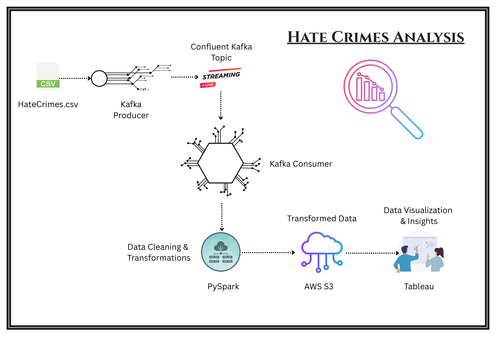

📊 Hate Crimes Analysis 🔍

Welcome to Hate Crimes Analysis, a real-time data streaming and transformation pipeline focused on analyzing hate crime data from 2017 to 2025. This project harnesses modern big data technologies like Confluent Kafka, PySpark, and AWS S3 to process and analyze hate crimes data efficiently. The goal is to build a scalable, production-ready pipeline that ingests data, transforms it in real-time, and stores it in Parquet format, enabling seamless downstream analysis and visualization.
🌐 Project Overview

This project implements a real-time ETL pipeline using:

    Confluent Kafka: For real-time data streaming.

    PySpark: For data cleaning, enrichment, and transformation.

    AWS S3: For storing transformed data in Parquet format.

We also plan to use Tableau and Google Colab to visualize insights from the transformed data.
📂 Data Source

Dataset: Hate Crimes 2017-2025 on Kaggle

This dataset includes records of hate crimes across years, with details like categories, descriptions, and demographics.
🚀 Key Features

✅ Real-Time Data Streaming: Using Confluent Kafka Producers.
✅ Data Transformation: Data cleaning and transformation with PySpark.
✅ Data Storage: Storing transformed data in AWS S3 (Parquet format).
✅ Visualization: Visualizing insights (planned) with Tableau/Google Colab.
✅ Flexible Development: Supporting both notebook-based (Google Colab) and script-based (VS Code) workflows.
🛠️ Technology Stack

    Confluent Kafka: Real-time streaming.

    PySpark: ETL and transformations.

    AWS S3: Data lake storage in Parquet format.

    Google Colab: Notebook-based development.

    VS Code: Kafka producer scripting.

    Python 3.8+

🏗️ Architecture Diagram

Below is the high-level architecture diagram illustrating the data flow in the pipeline:

Architecture Highlights:

    The CSV dataset is read by a Kafka Producer, which streams the data to a Confluent Kafka Topic.

    A Kafka Consumer reads the streamed data, which is then processed with PySpark for cleaning and transformation.

    The transformed data is stored in AWS S3 as Parquet files, making it efficient for downstream analysis.

    Future visualizations will be created using Tableau to uncover insights and trends.

⚙️ Installation

Clone the repository:

git clone https://github.com/ashrafali01/HateCrimesAnalysis.git
cd HateCrimesAnalysis
pip install -r requirements.txt

Kafka Setup

    Use either Confluent Kafka (free tier) or a local Kafka cluster.

    Configure your producer topics and credentials.

AWS Configuration

    Set up AWS credentials (e.g., aws configure) for S3 integration.

🖥️ Usage

1️⃣ Run Kafka Producer
From VS Code or terminal:

python kafka_producer.py

2️⃣ Run PySpark Transformation
Execute the PySpark job to consume data from Kafka, transform it, and write to AWS S3 in Parquet format:

spark-submit spark_transform.py

3️⃣ Visualization (Planned)
Use Tableau or Jupyter/Colab to explore the Parquet data in AWS S3 for insights and analysis.
📊 Visualization

The transformed data stored in AWS S3 will be visualized using Tableau, focusing on:

    Hate crime trends over time

    Crime categories and types

    Demographic patterns and insights

🤝 Contributions

We welcome contributions! Please fork the repository, create issues, or submit pull requests to:

    Enhance features

    Fix bugs

    Improve documentation

See CONTRIBUTING.md for guidelines.
📜 License

This project is licensed under the MIT License.
🙌 Acknowledgements

    Data Source: Kaggle Dataset by sonawanelalitsunil

    Libraries: Confluent Kafka, PySpark, AWS SDK, Pandas, etc.

    Special thanks to the open-source community and contributors.

📬 Contact

👤 Ashraf Ali
📧 ashrafali5530@gmail.com
